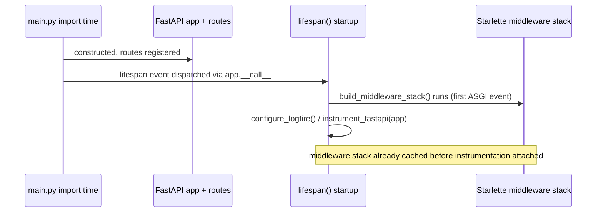

`traced_layer` works as both `@traced_layer("x")` and
`with traced_layer("x"):` because a `@contextmanager`-decorated generator
returns a `_GeneratorContextManager`, which subclasses
{{c1::ContextDecorator}}.

Extra: arbiter-l8 · Pattern: Context Manager as Decorator
See: docs/journal/arbiter-l8-2026-07-03T1916-otel-instrumentation.md

---

---
type: cloze
deck: Rhizome::arbiter-l8
tags: [arbiter-l8, root-span-fragmentation]
---
Synapse-L4's suspected trace-fragmentation bug traces back to calling
`instrument_fastapi(app)` inside {{c1::lifespan()}}, which only runs once
Uvicorn starts serving — by which point the FastAPI app and routes were
already constructed at {{c2::import time}}, and Starlette had already
built and cached its middleware stack on the first ASGI event.

Extra: arbiter-l8 · Anti-Pattern Avoided: Deferred SDK Initialization
See: docs/journal/arbiter-l8-2026-07-03T1916-otel-instrumentation.md

---
type: basic
deck: Rhizome::arbiter-l8
tags: [arbiter-l8, additive-observability]
---
Q: Why does `uv run pytest` print "connection refused" warnings and take a
few extra seconds when no local OTel Collector is running, and why wasn't
that "fixed" with a shorter exporter timeout?

A: The OTLP exporters retry with exponential backoff before giving up when
`localhost:4318` isn't listening — this is expected "additive observability"
behavior, not a bug: instrumentation degrades gracefully and never affects
correctness. Neither EventHorizon nor Synapse-L4 configures a custom
timeout either, so leaving the SDK default in place keeps arbiter-l8
consistent with the rest of the suite rather than diverging on a
unilateral judgment call.

Extra: arbiter-l8 · Challenge: OTLP Retry Backoff in Tests
See: docs/journal/arbiter-l8-2026-07-03T1916-otel-instrumentation.md

---
type: cloze
deck: Rhizome::arbiter-l8
tags: [arbiter-l8, circuit-breaker]
---
In the judge circuit breaker trace, an Ollama timeout followed by a Gemini
Flash success produces two sibling spans, {{c1::ollama_attempt}} and
{{c2::flash_attempt}}, both children of one {{c3::judge_call}} span.

Extra: arbiter-l8 · Pattern: Circuit Breaker (traced)
See: docs/journal/arbiter-l8-2026-07-03T1916-otel-instrumentation.md
