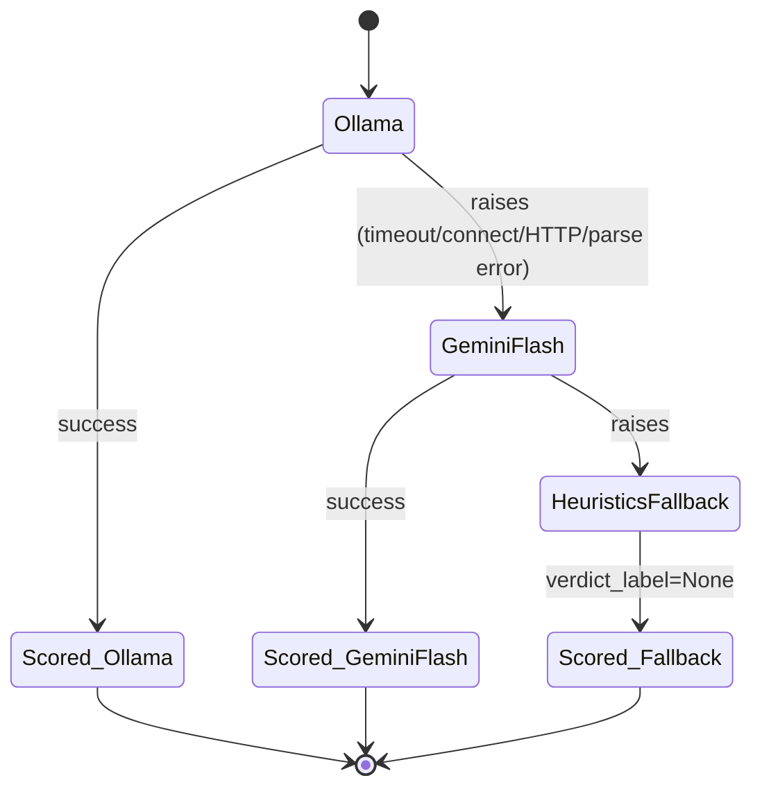

Both `_call_ollama` and `_call_gemini_flash` force strict-JSON output at the
{{c1::API level}} (Ollama's `"format": "json"`, Gemini's
`generationConfig.responseMimeType`) rather than relying on prompt
instructions alone to produce parseable output.

Extra: arbiter-l8 · Pattern: Circuit Breaker with a Real Fallback Chain
See: docs/journal/arbiter-l8-2026-07-04T1512-judge-layer.md

---
type: cloze
deck: Rhizome::arbiter-l8
tags: [arbiter-l8, prompts-convention]
---
`judge.py` loads its prompt template with `Path.read_text()` plus literal
{{c1::str.replace()}} substitution instead of `str.format()`, because the
template's JSON response example contains literal `{`/`}` characters that
`str.format()` would misinterpret as interpolation targets.

Extra: arbiter-l8 · Pattern: Prompts Convention Applied for the First Time in This Repo
See: docs/journal/arbiter-l8-2026-07-04T1512-judge-layer.md

---
type: cloze
deck: Rhizome::arbiter-l8
tags: [arbiter-l8, ollama, live-verification]
---
The Ollama judge request body sets {{c1::"think": false}}, or `qwen3.5`
(a hybrid reasoning model) emits a verbose thinking trace before answering,
~20x slower for no gain — the same gotcha already documented in
Sentinel-L7's `OllamaDriver`.

Extra: arbiter-l8 · Pattern: Circuit Breaker with a Real Fallback Chain
See: docs/journal/arbiter-l8-2026-07-04T1512-judge-layer.md

---
type: basic
deck: Rhizome::arbiter-l8
tags: [arbiter-l8, fixture-defect, live-verification]
---
Q: A live judge-validation run against `compliance_dataset.json` scored
only 6.7% accuracy. Why wasn't this evidence that the judge implementation
was broken?

A: The fixture's `raw_output` fields are Synapse-L4-shaped
(`status`/`anomaly_score`/`source_id`) but its `expected_label` values use
Sentinel-L7's `risk_level` vocabulary. The judge read `raw_output.status`
(e.g. `"nominal"`) and correctly restated it — right answer, wrong
taxonomy versus `expected_label` (e.g. `"low"`) for the same case.
`run_eval()` only ever compares `label` to `expected_label` and never
inspects `raw_output`, so this pre-existing mismatch was invisible until a
component (the judge) actually reasoned over `raw_output` content.

Extra: arbiter-l8 · Challenge: A 6.7% Accuracy Score That Wasn't the Judge's Fault
See: docs/journal/arbiter-l8-2026-07-04T1512-judge-layer.md

---
type: basic
deck: Rhizome::arbiter-l8
tags: [arbiter-l8, fixture-defect]
---
Q: Why was full judge validation against the ADR's required fixture-based
gate deferred to step 8 rather than fixed immediately in step 5?

A: Step 8 (ground-truth export) already plans to export real
Sentinel-shaped `{transaction, is_threat}` pairs from
`TransactionStreamService` — a taxonomy-consistent fixture the judge can
be meaningfully scored against. Patching the prompt or building a
throwaway fixture just to pass validation now would measure the judge
against synthetic conditions that don't match what step 8 will produce
anyway; the user chose to defer rather than do that work twice.

Extra: arbiter-l8 · Decision: Defer Full Judge Validation to Step 8
See: docs/journal/arbiter-l8-2026-07-04T1512-judge-layer.md

---
type: image-occlusion
deck: Rhizome::arbiter-l8
tags: [arbiter-l8, circuit-breaker]
diagram: judge-circuit-breaker
---
occlusions:
  - node: Ollama
    hint: which judge source is tried first?
    rect: left=.10:top=.20:width=.22:height=.10
  - node: GeminiFlash
    hint: what does the breaker fall through to when Ollama raises?
    rect: left=.40:top=.20:width=.24:height=.10
  - node: HeuristicsFallback
    hint: terminal state when both LLM judges are unavailable?
    rect: left=.72:top=.20:width=.24:height=.10

Header: JudgeCircuitBreaker fallback chain
Back Extra: arbiter-l8 · Pattern: Circuit Breaker with a Real Fallback Chain
See: docs/journal/arbiter-l8-2026-07-04T1512-judge-layer.md

